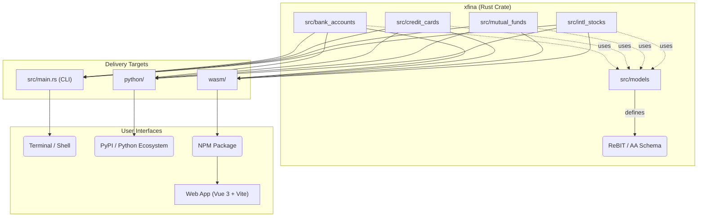

<p align="center">
  <a href="https://github.com/xfina-dev/xfina" target="_blank">
    
  </a>
</p>

# [Xfina](https://github.com/xfina-dev/xfina)

[](https://crates.io/crates/xfina)
[](https://pypi.org/project/xfina/)
[](https://www.npmjs.com/package/xfina-wasm)

**Xfina** is a collection of libraries (Rust, Python, JS), a command-line interface (CLI), and a web interface for extracting structured financial data from **Indian** bank statements, credit card statements, mutual fund reports, and international brokerage reports.

All parsers are compiled to **WebAssembly (WASM)** and run entirely in the browser — your financial data never leaves your device. 

🌐 **Live App**: [xfina.dev](https://xfina.dev/)

---

## Motivation & Vision

Most open-source financial parsers are written in Python, which requires users to set up a local toolchain and use a command-line interface (CLI), making them difficult to use directly via a web interface.

By building Xfina in **Rust**, we achieve:

1. **Privacy-first WASM Deployment** — WebAssembly (WASM) enables privacy-first tools that can run efficiently in the user's browser without sending sensitive financial data to any server. This zero-setup, browser-based solution empowers anyone who is comfortable with a web browser, Excel, or Google Sheets to easily extract a standardized data format without any technical overhead.
2. **Universal Bindings** — Xfina natively supports Python and JS bindings, allowing the core parsing logic to be used seamlessly across any environment. The project is published to Rust crates, npm, and PyPI.
3. **ReBIT & Sahamati AA Standards** — The internal data schema is heavily built on top of the Sahamati Account Aggregator (AA) and ReBIT standards. Xfina offers a ready-made ReBIT JSON interface out-of-the-box, ensuring interoperability with standard Indian financial ecosystems.

---

## Supported Parsers & Status

| Category | Institution / Provider | Format | Status | Notes |
|---|---|---|---|---|
| 🏦 Bank Account | Axis Bank | XLS | **Production Ready** | Full support |
| 🏦 Bank Account | Bank of Baroda | XLS | **Production Ready** | Full support |
| 🏦 Bank Account | HDFC Bank | XLS | **Production Ready** | Full support |
| 🏦 Bank Account | ICICI Bank | XLS | **Production Ready** | Full support |
| 🏦 Bank Account | State Bank of India | PDF (password protected) | **Production Ready** | Full support |
| 💳 Credit Card | Axis Bank | XLSX | **Production Ready** | Statement period derived from transactions; Axis prints no statement date |
| 💳 Credit Card | HDFC Bank | XLS | **Production Ready** | Full support incl. add-on cardholders, reward points |
| 💳 Credit Card | ICICI Bank | XLS, CSV (older monthly export) | **Production Ready** | Tested card without any add-on cards; the CSV prints no statement date or totals, so its period is derived from transactions and nothing is reconciled |
| 📈 Mutual Funds | CAMS | PDF (password protected) | **Production Ready** | Combined Account Statement (CAS) |
| 📈 Mutual Funds | KFinTech | PDF (password protected) | **TODO** | Combined Account Statement (CAS) |
| 🌍 Intl Brokers | Interactive Brokers (IBKR) | CSV | **Production Ready** | Activity statements |
| 💱 Reference Rates | State Bank of India | PDF | **Production Ready** | Daily forex card rate sheet — every currency and every rate column the sheet prints. A reference document, not an account, so it has no ReBIT form |

*Note: Bank Account parsers have not been tested with Joint Accounts.*

### Public data: price, NAV and index history

Formats fall into two areas. **Personal statements** (above, except the rate sheet) describe an account somebody holds. **Public data** is what a publisher hands to anyone: the SBI rate sheet and the price histories below. Each history parses into one `PriceSeries` -- a superset row whose fields (`close`, `nav`, `totalReturn`, `netTotalReturn`, the `adj*` twins, `dividend`, `splitFactor`, …) a file fills as far as it prints them, with anything else kept under the publisher's own heading. ReBIT has no form for a price history.

Each file is read on its own. A history that arrives in pieces -- a year of NSE index levels per download, five years of AMFI NAVs -- comes back as one series per piece; putting pieces together is left to the caller.

| Publisher | Format | Series | Notes |
|---|---|---|---|
| AMFI | XLSX | Mutual fund NAV | NAV history export; the period it prints is checked against its rows |
| NSE | CSV | Exchange price | Security-wise archive and the quote page download |
| NSE Indices | CSV | Total return / net total return, or price index | Total returns index values; historical index data for debt indices |
| MCX | XLS (HTML) | Spot price | Every intraday poll kept with its time |
| BlackRock iShares | XLS (XML Spreadsheet 2003) | NAV | US funds with each dividend on its ex-date, checked against the Distributions sheet; UCITS and Swiss funds |
| Tiingo | CSV | Price, adjusted price, dividends, splits | A mutual fund's close is read as its NAV |
| The Wall Street Journal | CSV | Price | Historical prices download |
| MSCI | XLSX | Net / gross total return, or price index | Index level export |
| Nasdaq | XLSX | Price index, or total return (XNDX) | End-of-day history |
| Yahoo Finance | CSV | Price, with dividends and splits | yfinance output and Yahoo's classic table; closes already split-adjusted |
| SPDR Gold Shares | XLSX | Market close and NAV | GLD historical archive |

---

## Architecture

The project is structured as a **Cargo workspace** that unifies data models, parsers, and cross-platform bindings into a single, cohesive repository:



The directory structure is as follows:

```text
xfina/
├── src/                  # Unified xfina Rust crate
│   ├── models/           # Shared data models (ReBIT / AA standard compatible)
│   ├── bank_accounts/    # Bank Account parsers (HDFC, ICICI, SBI, BoB, Axis)
│   ├── credit_cards/     # Credit Card parsers (HDFC, ICICI, Axis)
│   ├── mutual_funds/     # Mutual Fund parsers (CAMS)
│   ├── intl_stocks/      # International Broker parsers (IBKR)
│   └── main.rs           # Terminal command-line interface (CLI)
├── wasm/                 # WASM bindings (wasm-bindgen)
├── python/               # Python bindings (pyo3)
├── xtask/                # Custom build scripts and site deployment logic
└── web/                  # Vue 3 + Vite frontend (deployed via GitHub Pages)
```

### Data Models (`xfina-models`)

- **`CreditCardAccount`** — card details, statement period, account summary, transactions, reward points
- **`DepositAccount`** — account info, opening/closing balances, transactions
- **`EquityAccount`** — investor info, stock holdings, corporate actions, trades (International Brokers)
- **`MutualFundsAccount`** — investor info, AMC schemes, NAV, transactions (Mutual Funds)

All data structures inherently map to the Sahamati AA specifications, with project-specific extensions nested in the `xfina` object.

---

## Command Line Interface (CLI)

Xfina provides a blazing fast Rust CLI tool for parsing statements directly from your terminal and exporting them to JSON.

### Installation

```bash
cargo install xfina --features cli
```

### Usage

```bash
xfina parse <FILE> [--as <FORMAT>] [--schema xfina|rebit] [--password <PWD>] [--output <PATH>] [--csv]
xfina detect <FILE>
xfina formats [--area personal|public]
```

The format is worked out from the file's content; `--as` pins one instead.

**Examples:**
```bash
# Parse a bank statement
xfina parse statement.xls

# Parse a password-protected mutual fund statement into strict ReBIT
xfina parse portfolio.pdf --password "mysecret" --schema rebit

# Write a price history as CSV in Tiingo's column layout
xfina parse SPY.csv --csv

# List the public data formats and where to download each
xfina formats --area public
```

---

## Rust Library Usage

You can also use Xfina directly as a Rust library in your own projects:

```toml
[dependencies]
xfina = "0.2"
```

```rust
use xfina::{parse, ParseRequest, Schema};

fn main() -> Result<(), xfina::error::XfinaError> {
    let bytes = std::fs::read("statement.xls").unwrap();

    // Hand over the file; xfina works out which parser it needs.
    let statement = parse(
        ParseRequest::new(&bytes).with_filename(Some("statement.xls")),
    )?;

    println!("{} ({})", statement.institution(), statement.format);
    println!("{}", statement.to_json_string(Schema::Xfina, true)?);

    // To skip detection, pin the format:
    //   ParseRequest::new(&bytes).with_format(Format::from_id("ba-hdfc"))
    Ok(())
}
```

---

## Web App

The [`web/`](./web) directory contains a **Vue 3 + Vite** frontend that uses the WASM module to parse files directly in the browser.

### Features

- 🔒 **100% client-side** — no server, no uploads
- ⚡ **Rust/WASM performance** — parsing in milliseconds
- 📊 **Rich UI** — statement header, account summary, transaction table
- 📈 **Public data tab** — price histories grouped by dataset, with each file's coverage, gaps and checks, and CSV/JSON downloads
- 🌙 **Dark mode** support
- 🏷️ **ReBIT compliance** — Direct JSON serialization into ReBIT structures

### Running Locally

```bash
# 1. Build WASM
cd wasm
wasm-pack build --target web

# 2. Start dev server
cd ../web
npm install
npm run dev
```

### Deployment

Pushed to `main` → GitHub Actions automatically builds the unreleased WASM + Vue site and deploys to `unreleased/` on GitHub Pages.
Tagged releases (`v0.1.3`) → Deploys a permanent, versioned snapshot (`/0.1/`) which is mirrored to the root at [xfina.dev](https://xfina.dev/).

---

## Roadmap

### Initial Launch Targets

| Institution / Provider | Bank Account | Credit Card | Mutual Funds | Intl Brokers |
|---|:---:|:---:|:---:|:---:|
| Axis Bank | ✅ | ✅ | | |
| Bank of Baroda | ✅ | | | |
| CAMS | | | ✅ | |
| HDFC Bank | ✅ | ✅ | | |
| IBKR | | | | ✅ |
| ICICI Bank | ✅ | ✅ | | |
| KFinTech | | | ⏳ | |
| State Bank of India | ✅ | | | |

### Upcoming
- [ ] CSV / JSON export full support
- [ ] KFinTech combined statement parser

## License

[Apache 2.0](./LICENSE)
